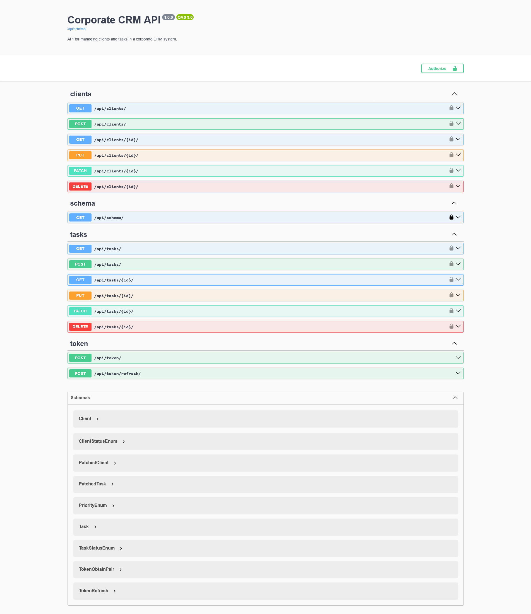

## 📸 API Preview



## 📌 Overview

# Corporate CRM API

A production-ready REST API for managing clients and tasks with authentication, filtering, and documentation.

---

## 🚀 Technologies

- Python
- Django
- Django REST Framework (DRF)
- JWT Authentication
- SQLite (development database)
- drf-spectacular (Swagger/OpenAPI)

---

## ✅ Features

- User authentication (JWT)
- Clients and tasks management (CRUD)
- Data isolation per user
- Filtering, search, and ordering
- API documentation (Swagger & Redoc)

---

## 📡 API Endpoints

### Authentication
- POST `/api/token/`
- POST `/api/token/refresh/`

### Clients
- GET `/api/clients/`
- POST `/api/clients/`
- GET `/api/clients/{id}/`
- DELETE `/api/clients/{id}/`
- PUT `/api/clients/{id}/`
- PATCH `/api/clients/{id}/`

### Tasks
- GET `/api/tasks/`
- POST `/api/tasks/`

---

## ⚙️ How to Run

```bash
git clone https://github.com/CharlesNeres/corporate-crm.git
cd corporate-crm

python -m venv venv
source venv/bin/activate  # or venv\Scripts\activate on Windows

pip install -r requirements.txt

python manage.py migrate
python manage.py runserver 
```

---

## ⚙️ Environment Variables

- Create a .env file in the root directory and add:
```bash 
SECRET_KEY=your_secret_key_here
DEBUG=True
ALLOWED_HOSTS=127.0.0.1,localhost
 ```

- Generate a secret key with:
```bash 
python -c "import secrets; print(secrets.token_urlsafe(50))"
 ```

## 🔐 Authentication

1. Go to `/api/token/`
2. Send your username and password
3. Copy the access token
4. Use it in headers: 

Authorization: Bearer YOUR_TOKEN

## 📚 API Documentation

- Swagger UI: `/api/docs/`
- Redoc: `/api/redoc/`

## 🧠 What I Learned

- Building REST APIs with Django REST Framework
- Implementing JWT authentication
- Structuring scalable backend systems
- Using Swagger/OpenAPI for API documentation

## 🔮 Future Improvements

- PostgreSQL integration
- Docker setup
- Deployment to cloud (AWS / Railway / Render)